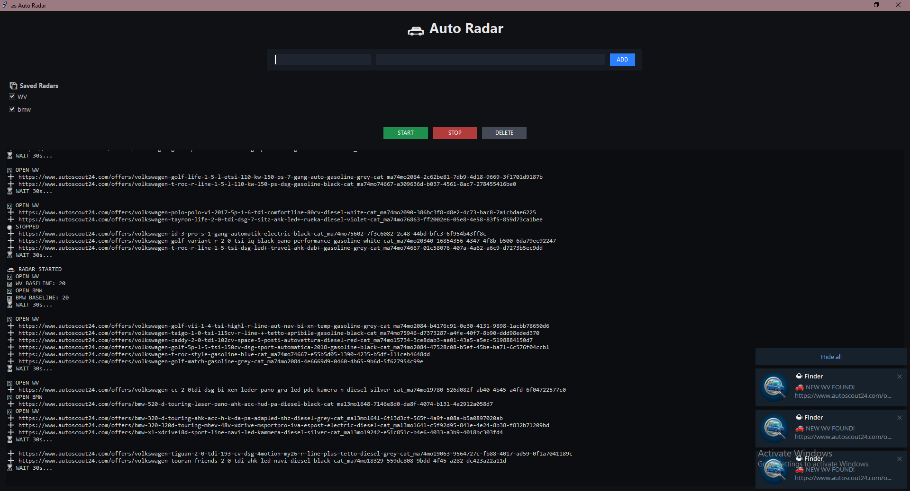
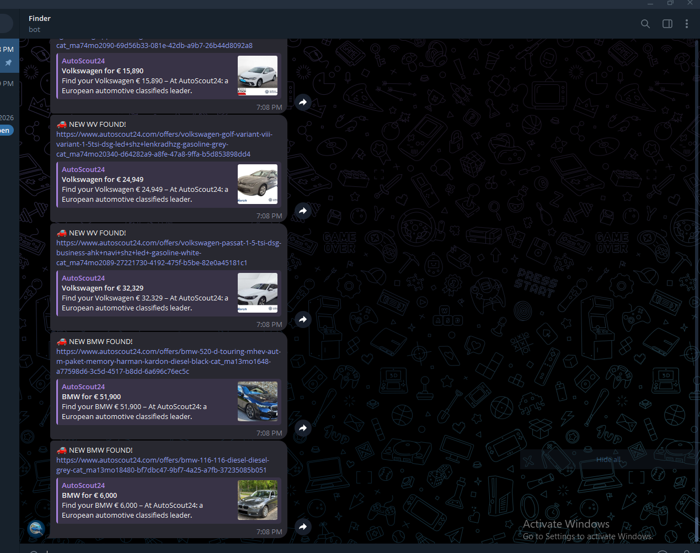

# 🚗 Car Finder

Car Finder is a Python desktop application that monitors car listings and automatically notifies users when new vehicles matching their search criteria appear.

## Features

- Real-time car listing monitoring
- Automatic detection of newly published listings
- Telegram notifications for new offers
- SQLite database for storing saved searches
- User-friendly Tkinter interface
- Automated web scraping with Playwright

## Technologies Used

- Python
- Tkinter
- Playwright
- SQLite
- Requests
- Telegram Bot API

## How It Works

1. Add one or more search URLs from the supported marketplace.
2. Select the searches you want to monitor.
3. Start the radar.
4. The application continuously checks for newly published listings.
5. When a new listing is detected, a Telegram notification is sent automatically.

## Installation

Install dependencies:

```bash
pip install -r requirements.txt
```

Install Playwright browser:

```bash
playwright install
```

Run the application:

```bash
python carfinder.py
```

## Screenshots

### Main Interface




### Telegram Notification



## Project Purpose

This project was developed as a portfolio application to demonstrate:

- Desktop application development
- Web scraping and automation
- Database integration
- API integration
- Multithreading
- Real-world problem solving

## Author

Mihajlo Blagojevic
